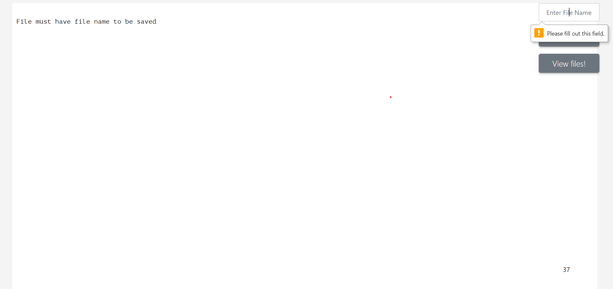
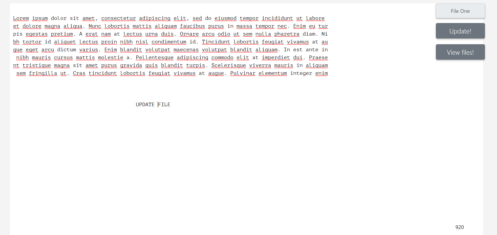
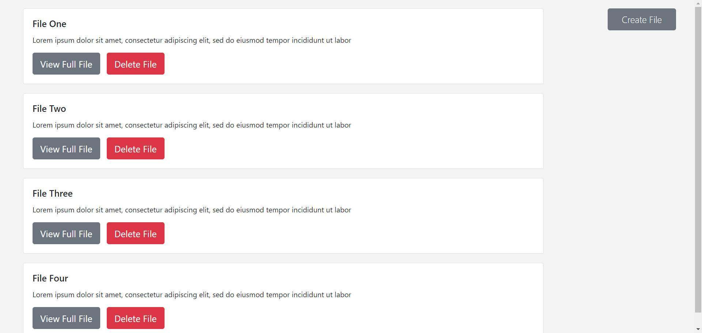

# Text Editor
This text editor implement the basic opertation like create, update, delete as well as viewing saved files 
# Used Technologies 
HTML, CSS, JavaScript, Node JS
# Database 
 Mongodb 
# Used NPM packages 
Express, EJS, Body-parser, Mongoose

# Create File

# Update File 

# View All Saved Files 

